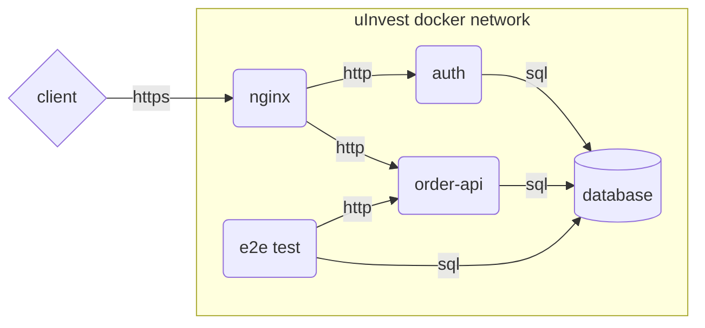

# The Plan

This document details my initial thoughts when considering how to approach the given problem, though they may change as development evolves.

### TLDR Structure

I am considering using the following structure for the services (collectively called uInvest). Everything within the uInvest docker network subgraph is a container.

### Services Overview

##### Client

The client will be simulated using postman so I can focus on the backend, but it should be fairly straightforward to integrate the service into a frontend solution like a flutter app.

##### Nginx

This container performs reverse proxying, basic rate limiting, TLS termination, and authorisation sub requests. The TLS certificate will be unsigned given the lack of a domain name, but setting up a signed certificate would not be difficult with a certbot container.

##### Order Api

This container accepts http requests to carry out instructions. Each instruction should have its own endpoint. Communicates with the database to verify that instructions are possible to execute from a business logic standpoint.

- The go library gin will be used to create http handlers for each instruction.
- The go library gorm will be used to reduce the boilerplate when interacting with the database, though if there was a specific performance requirement then I might reconsider as there is some overhead with gorm.

##### Auth

Allows login using pre defined credentials, which will return a JWT to the client. The client will use this JWT when making instruction requests. Before allowing an instruction request to continue to the order-api, nginx will perform a sub request to verify the validity of the JWT.

##### E2E Test

This container is used to inject test data into the database, and then run a series of end to end tests on the order api to verify that it performs as expected.

##### Database

A mysql container that stores the client's holdings, hashed login credentials, and purchasable assets.

### Other Considerations

- The repository is a monorepo, with all micro/mini services comprising the software product residing within it.
- Docker will be used to containerise the services, and Docker Compose will be used as a basic container orchestrator.
- A makefile will be used to reduce the friction of executing development tasks such as building, starting, stopping and restarting containers.
- Care must be taken handling money to avoid any inconsistencies due to rounding up or floating point errors.
